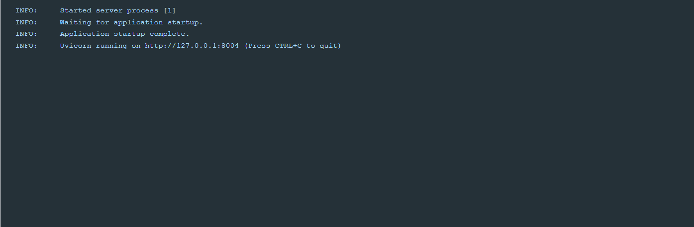
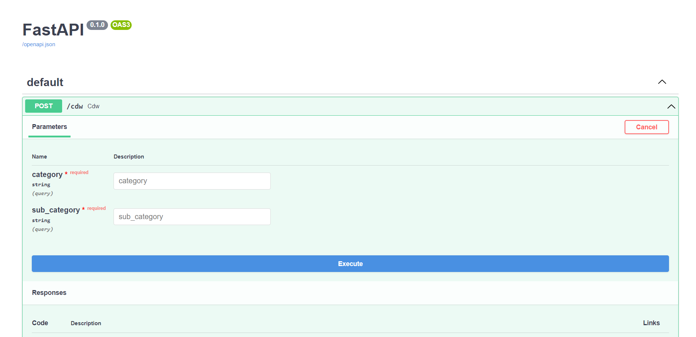
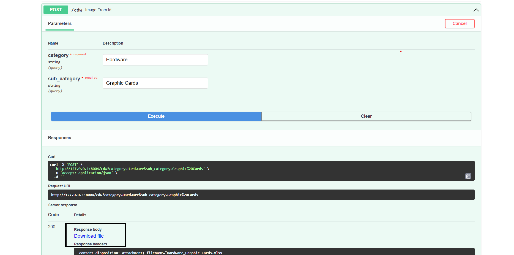
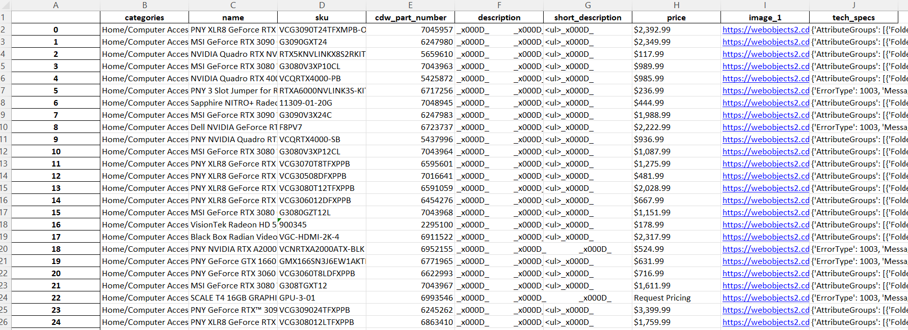

## CDW using [FastAPI](https://fastapi.tiangolo.com/) , [Uvicorn](https://www.uvicorn.org/#introduction) and [Docker]('https://www.docker.com/')

### FastAPI

FastAPI is a modern, fast (high-performance), web framework for building APIs with Python 3.9+ based on standard Python type hints.

### Uvicorn

Uvicorn is a lightning-fast ASGI server implementation.

## Setting up the VirtualEnv and install dependencies

Dependencies will be installed from the requirements. Python version 3.9.2 is used for this project.

| Library | Version |
| ------ | ------ |
| [requests](https://pypi.org/project/requests/)                | 2.27.1    |
| [scrapy](https://pypi.org/project/Scrapy/)                    | 2.6.1     |
| [uvicorn](https://pypi.org/project/uvicorn/)                  | 0.17.6    |
| [fastapi](https://pypi.org/project/fastapi/)                  | 0.78.0    |
| [pandas](https://pypi.org/project/pandas/)                    | 1.4.2     |

## Run the Application

py main.py

This will start the application on port 8004
The server will start at : <http://localhost:8004/docs>

# Docker commands 

start docker service then,

create image :  <b>docker build -t cdw . </b>

run docker image :  <b>docker run -d --name container -p 8004:8004 cdw </b>

## Test the application

FastAPI also automatically generated fully interactive API documentation that we can use to interact with our API. 
We can visit http://127.0.0.1:8004/docs in our browser to see the interactive API documentation provided by [Swagger UI](https://github.com/swagger-api/swagger-ui):

The server will start at <http://localhost:8004/docs>.

We have set two input parameters category and subcategory, both parameters are mandatory and it must be string parameter.

Once, we execute this api we got the excel file.

# Sample

# Thank you!!!